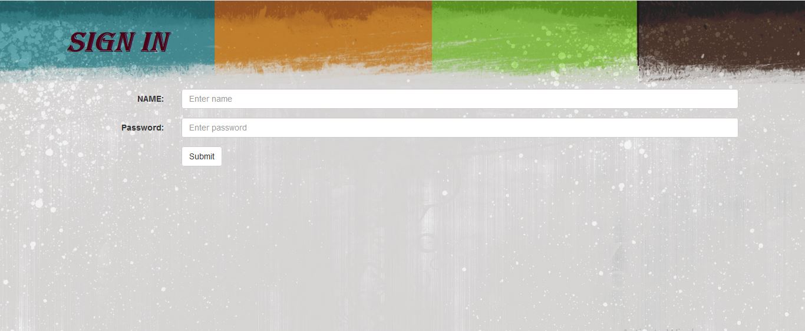

# Prescription-Viewer-Application
An Website + Andriod application was build to eliminate the use of paper for providing prescriptions.A website has been developed for entering the prescription details which is sent to the Prescription Viewer App present in the patient’s phone using [Firebase](https://firebase.google.com/) Database. Three people have access to the website – Admin, Doctor and Receptionist. They can access the website by logging in using their respective username and password.

-	The admin controls the website. New Doctor Accounts and Receptionist accounts are created by the admin. 
-	The receptionist enters the details of the patients into the website when the patients visit the hospital for the first time. A patient is registered under a particular doctor. 
-	The doctor can view the details of his patients. The doctor enters the prescription details into the website and it is sent to the patient’s phone.

Then patient enter its patient id in Prescription Viewer Android app on which prescription provided by doctor is retrieved from firebase database.

# Steps to run file
1. Download the code from repository
```
 - put index.php and "inc" folder in htdocs directory of xampp folder (I have used xampp server for storing data).
 - Other files are andriod application file.
 ```
2. Create database named Prescription and add following tables under it:
```
 - doctor(ID, Name, Gender, Age, Department, Email, Address, Mobile_No, Username, Password), 
 - login(Username, Password), 
 - patient(pat_id, doc_id, pat_name, pat_gender, pat_email, pat_address, pat_mobile),
 - receptionist(rec_id, rec_name, rec_gender, rec_age, rec_email, rec_address, rec_mobile, rec_username, rec_password),
 - prescribe(pat_id, Mor_name, After_name, Nig_name, days, dosage)
 ```
3. Manually add username and password in login database for admins. Only Admins can add doctors and receptionists details to            restrict authority of adding details.
4. On any browser use this link "localhost/index" to run web application.
5. For storing prescription details to firebase. Make necessary changes to inc/firebase.php file.

# Screenshots application developed. 
### Web Application Screenshots:
    
### Andriod App:
 
